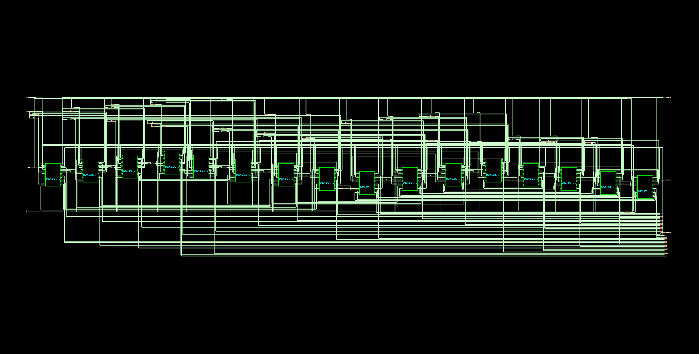
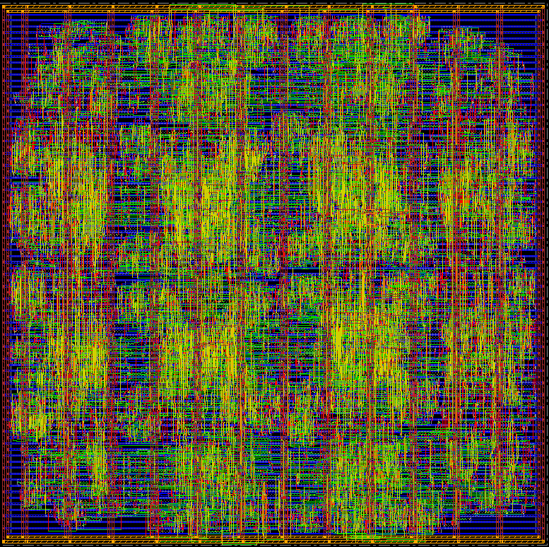

# 4x4 2D Mesh Network-on-Chip (NoC) Router Using XY Algorithm— RTL to GDSII

A 4×4 2D mesh Network-on-Chip implemented in Verilog and taken through a
complete RTL-to-GDSII physical design flow using the Cadence digital
implementation suite, targeting the SCL 180nm PDK.

## Overview

- **Topology:** 4×4 2D mesh, XY (dimension-order) routing
- **Router:** genuine 5-port (Local / North / South / East / West) crossbar
  with per-input single-flit registers, ready/valid handshaking, and a
  per-output round-robin arbiter driving a one-hot crossbar mux
- **Top module:** `mesh_4x4_top` (16× `noc_router` instances, parameterized
  by `XPOS`/`YPOS`, wired into a 2D mesh with N/S/E/W neighbor links)
- **PDK:** SCL 180nm, 6-metal (6M1L) stack, SS (slow-slow) signoff corner
- **Clock:** 50 MHz

Post-synthesis gate-level schematic of one router instance:


## Toolchain

| Stage              | Tool                          |
|---------------------|-------------------------------|
| Synthesis           | Cadence Genus                 |
| Place & Route       | Cadence Innovus               |
| Power Analysis      | Cadence Voltus (via Innovus)  |
| GDSII Streamout     | Cadence Innovus (`streamOut`) |

## Flow

```
RTL (Verilog)
   │  Genus: syn_generic → syn_map → syn_opt
   ▼
Gate-level netlist
   │  Innovus: init_design → floorplan → power planning
   │           (rings + stripes + sroute — BEFORE place/route)
   │           → placement → CTS (ccopt_design) → routing
   │           → post-route optimization
   ▼
Signoff: DRC / geometry / connectivity / power connectivity / timing
   ▼
GDSII (mesh_4x4_top.gds)
```

> **Design note:** power planning (ring + stripe generation + `sroute`) must
> run *before* placement and detailed routing. Running it after routing
> caused the detail router's pre-existing signal wires to physically
> collide with the newly added power geometry, producing hundreds of
> metal-short DRC violations. Reordering the flow so the router treats
> VDD/VSS as real obstacles from the start eliminated all violations.

## Final Signoff Results

| Check                     | Result                        |
|----------------------------|-------------------------------|
| DRC                        | ✅ No violations               |
| Geometry                   | ✅ 0 violations (all categories) |
| Connectivity               | ✅ No problems or warnings     |
| Power connectivity (VDD/VSS)| ✅ No problems or warnings     |
| Timing (setup, SS corner)  | ✅ +9.087 ns slack              |

**Design statistics:**

| Metric              | Value                     |
|----------------------|---------------------------|
| Standard cell instances | 5,542                  |
| Total std-cell area  | 153,927.4 µm²             |
| Core utilization     | 65.68%                    |
| Clock frequency      | 50 MHz                    |
| Total power          | 7.063 mW                  |
| — Internal power     | 4.089 mW (57.9%)          |
| — Switching power    | 2.973 mW (42.1%)          |
| — Leakage power      | 0.0015 mW (0.02%)         |

Per-tile area naturally scales with router connectivity — corner routers
(2 active ports) are smallest (~5,100–5,800 µm²), edge routers
(3 active ports) are mid-sized (~8,500–9,800 µm²), and the four center
routers (all 5 ports active) are largest (~13,400–14,700 µm²).

## Output

Final routed layout in Innovus, showing the 4×4 mesh structure, full
metal-stack routing (M1–M6), and the power ring/stripe network added
prior to placement and routing:




## Repository Structure

```
.
├── assets/
│   └── layout_final.png     # screenshot of the final routed layout
├── rtl/                    # Verilog source
│   ├── rr_arbiter.v
│   ├── noc_router.v
│   ├── mesh_4x4_top.v
│   └── tb/
│       └── tb_mesh_4x4_top.v   # testbench
├── constraints/             # SDC timing constraints
├── synthesis/
│   ├── genus_synth.tcl      # Genus synthesis script
│   └── reports/             # timing / area / power / qor / gates (post-synth)
├── pd_flow/
│   ├── innovus_mesh_4x4_flow.tcl   # Innovus P&R script (final, correct order)
│   ├── mmmc_view.tcl                # single-corner (SS) MMMC view
│   └── reports/              # DRC / geometry / connectivity / power / timing / area (post-PD)
├── gds/
│   └── mesh_4x4_top.gds       # final signed-off GDSII (see note below)
└── README.md
```

> GDSII and other large binary outputs are tracked with Git LFS — see
> setup instructions below.

## Reproducing the Flow

1. Synthesize: run `synthesis/genus_synth.tcl` in Genus against the SCL180
   6M1L liberty (`tsl18fs120_scl_ss.lib`), targeting `mesh_4x4_top`.
2. Place & route: run `pd_flow/innovus_mesh_4x4_flow.tcl` in Innovus. This
   performs floorplanning, power planning, placement, CTS, routing,
   post-route optimization, signoff checks, and GDSII streamout in one
   pass.
3. Signoff reports and the final GDSII land under `pd_flow/reports/` and
   `gds/` respectively.

## License

TBD
